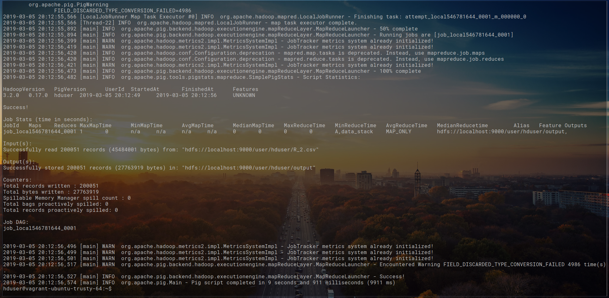

# StackExchange_DataProcessing
Repo for data processing using Hadoop, Pig and Hive. 
Hadoop environment setup guide [here](docs/VM_setup_instructions) on a local VM using Vagrant.

## Obtain data from Stack-Exchange ~200k Rows

### StackExchange only allows to fetch 50k rows in one query, as a result run 4 queries to get 200k. 
[Data Link](https://data.stackexchange.com/stackoverflow/query/new)

### Top 200k posts by ViewCount in DESCENDING order
### Top/First 50k
`select top 50000 * from posts where posts.ViewCount > 28574 order by posts.ViewCount DESC`
### Next 50k
`select top 50000 * from posts where posts.ViewCount <= 86658 order by posts.ViewCount DESC`
### Next 50k
`select top 50000 * from posts where posts.ViewCount <= 51008 order by posts.ViewCount DESC`
### Next 50k
`select top 50000 * from posts where posts.ViewCount <= 36583 order by posts.ViewCount DESC`
### Extra buffer over 200k for fun
`select top 50 * from posts where posts.ViewCount <= 28575 order by posts.ViewCount DESC`
#### Note: ViewCount range(s) in the above query are subject to change as data updates daily

### StackExchange provides data in CSV format, so we should have Query1.csv, Query2.csv, Query3.csv, Query4.csv and Query5.csv

## # Combine the dataset

### To combine the whole results of the 5 queries, simple bash commands can be used (why bash?..I just find bash to use)
```
$ echo \n >> Query5.csv

$ echo \n >> Query4.csv

$ echo \n >> Query3.csv

$ echo \n >> Query2.csv

$ cat Query5.csv >> Query4.csv

$ cat Query4.csv >> Query3.csv

$ cat Query3.csv >> Query2.csv

$ cat Query2.csv >> Query1.csv
```

## # Data Preprocessing

### Here I have used R to preprocess the dataset and remove the messy 'Body' column
```
stack_data <- read.csv('/home/harshal/Query1.csv', header = T)
stack_data$Body <- NULL 
write.csv(stack_data,'/home/harshal/Query.csv')
```

### Once files are combined and preprocessed, load data into HDFS using Pig for further cleaning

### Before loading the file into Pig, make sure to copy the file from local storage to hdfs

```
grunt> copyFromLocal Source_file_path Destination_file_path
```

### Below you can find the script for loading and preprocessing the data

```
REGISTER '/home/hduser/pig/pig-0.17.0/lib/piggybank.jar';
REGISTER '/home/hduser/hive/apache-hive-3.1.1-bin/hcatalog/share/hcatalog/hive-hcatalog-core-3.1.1.jar'


data_stack = LOAD 'Query.csv' USING org.apache.pig.piggybank.storage.CSVExcelStorage(',','YES_MULTILINE') AS(Id:int, PostTypeId:int, AcceptedAnswerId:int, ParentId:int, CreationDate:datetime, DeletionDate:datetime, Score:int, ViewCount:int, OwnerUserId:int, OwnerDisplayName:chararray, LastEditorUserId:int, LastEditorDisplayName:chararray, LastEditDate:datetime, LastActivityDate:datetime, Title:chararray, Tags:chararray, AnswerCount:int, CommentCount:int, FavoriteCount:int, ClosedDate:datetime, CommunityOwnedDate:datetime);

-- We are going to select only the required fields
A = foreach data_stack generate Id, Score, ViewCount, OwnerUserId, OwnerDisplayName, Title, Tags;

STORE A INTO 'result' USING org.apache.pig.piggybank.storage.CSVExcelStorage(',','NO_MULTILINE','NOCHANGE','WRITE_OUTPUT_HEADER');

```

### Create a file pig_script.pig and execute with mapreduce option
`$ pig -x mapreduce pig_script.pig`



### The above script will generate a directory 'result' in hdfs, inside the directory there is file `part-m-0000` or similar which is the new generated CSV file

`grunt> copyToLocal result 'Destination_path'`


```
$ cd result 
$ mv part-m-0000 ~/Query.csv
```
## # Data Loading

### Create a table `'stack'` in hive and load the new CSV file into a hive table

```
hive> create external table if not exists stack (Id int, Score int, ViewCount int, OwnerUserId int, OwnerDisplayName string, Title string, Tags string)
ROW FORMAT DELIMITED
FIELDS TERMINATED BY ',';

hive> load data local inpath 'Query.csv' overwrite into table stack;
```
### Check data is loaded 
`hive> select * from stack limit 10;`

## # Data Querying
    
    
### The top 10 posts by score 
`hive> select Title, Score from stack order by Score desc limit 10;`


### The top 10 users by post score 
`hive> create table grouped_users as select ownerUserId as a, SUM(Score) as b from stack group by ownerUserId;`

`hive> select * from grouped_users order by b desc limit 10;`


### The number of distinct users, who used the word ‘hadoop’ in one of their posts
 
`hive> select COUNT(DISTINCT OwnerUserId) from stack where Tags like '%hadoop%';`


## # Calculate TF-IDF 

### Below queries use HIVE MALL. Installation can be found [here](https://github.com/myui/hivemall/wiki/Installation) and [TF-IDF](https://github.com/myui/hivemall/wiki/TFIDF-calculation) 
### _TF-IDF in Hive using HIVE MALL_
```
hive> add jar /tmp/hivemall-core-0.4.2-rc.2-with-dependencies.jar;
hive> source /tmp/define-all.hive;

hive> create temporary macro max2(x INT, y INT) if(x>y,x,y);

hive> create temporary macro tfidf(tf FLOAT, df_t INT, n_docs INT) tf * (log(10, CAST(n_docs as FLOAT)/max2(1,df_t)) + 1.0);

hive> create table tf_table as select ownerUserId, Title from stack order by Score desc limit 10;
hive> create view exploded as select ownerUserId, word from tf_table LATERAL VIEW explode(tokenize(Title, True)) t as word where not is_stopword(word);

hive> create view term_frequency as select ownerUserid, word, freq from (select ownerUserId, tf(word) as word2freq from exploded group by ownerUserId) t LATERAL VIEW explode(word2freq) t2 as word, freq;

hive> create or replace view document_frequency as select word, count(distinct ownerUserId) docs from exploded group by word;

hive> select count(ownerUserId) from tf_table;
hive> set hivevar:n_docs=10;

hive> create or replace view tfidf as select tf.ownerUserId,  tf.word, tfidf(tf.freq, df.docs, ${n_docs}) as tfidf from  term_frequency tf  JOIN document_frequency df ON (tf.word = df.word) order by tfidf desc;

hive> select * from tfidf;
```


